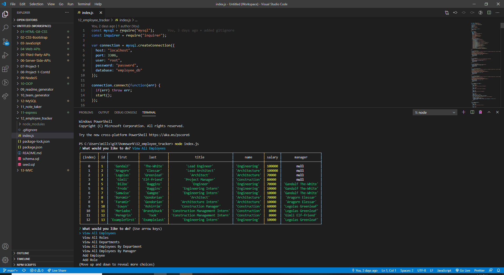

# **12_employee_tracker**

[Github Link](https://github.com/Millsy4/12_employee_tracker)
## **Description**

This project was created to allow people to create and delete notes when they finish them.  The idea is for it to be similar to a to do list, but the main objective was to learn about express servers and understanding how to create and host our own servers.
  
## **Table of Contents**
  
* [Installation](#installation)

* [Usage](#usage)
  
* [License](#license)
  
* [Contributing](#contributing)
  
* [Tests](#tests)
  
* [Questions](#questions)
  
## **Installation**
  
To install necessary dependencies, run the following command:
  
*npm i*
  
## **Usage**
  
To use this program, open the Heroku based site and you will be shown a list based on anything you placed in the note list previously.  If you wish to add a note, you simply fill in the Title and Text fields and then click the Save (floppy disk) icon after you're finished, this will save your note to the list field on the left.  If you wish to view that note again, all you have to do is click on the note off to the left side to pull it's information up.  If you wish to delete the note, then simply click the trash can icon off to the right of the note and it will be removed from the list.
  
## **License**
  
This project is licensed under the MIT license.
  
## **Contributing**
  
If you wish to contribute, my only request is that you contact me beforehand.  My contact information will be at the bottom of this README if you wish to do so.  Thank you.
  
## **Tests**
  
To run tests, run the following command:
  
*npm test*

Currently there are no tests setup for this program.
  
  
## **Questions**
  
If you have any questions about the repo, open an issue or contact me directly at *millsy4@hotmail.com*.
You can find more of my work at [Millsy4](https://github.com/Millsy4/).

## **Screenshots**
